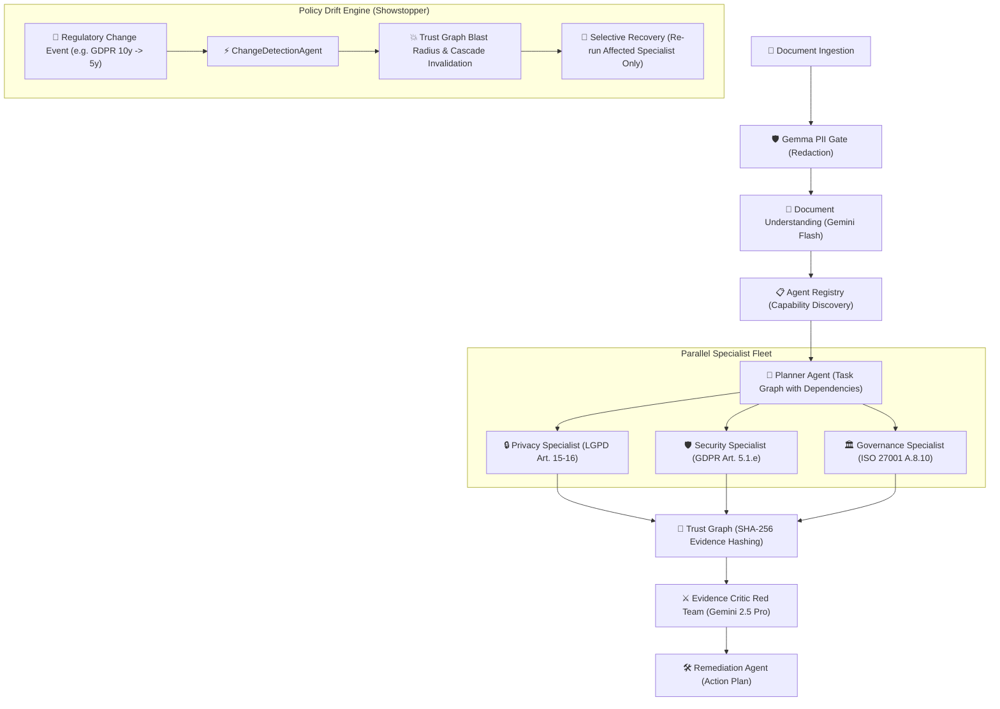

# AEGIS — Autonomous Enterprise Governance Intelligence System

[](tests/)
[](requirements.txt)
[](#)
[](#multi-model-ai-architecture)

> **"The investigation was complete. Then the rules changed. AEGIS reacted autonomously."**

AEGIS is an autonomous multi-agent governance platform designed for continuous regulatory compliance, adversarial evidence auditing, and real-time policy drift adaptation across complex multi-jurisdiction environments (**LGPD**, **GDPR**, **ISO 27001**).

---

## 🏆 Multi-Model AI Architecture 

AEGIS implements a fortified multi-model strategy utilizing specialized Google models with a built-in deterministic fallback engine (`REPLAY_MODE`):

| Agent / Component | Model | Role & Purpose | Bonus Justification |
|---|---|---|:---:|
| **PII Gate Scanner** | **Gemma 2 (Model Garden)** | Pre-flight privacy sanitization of sensitive documents (CPF, emails, tokens, IP traces) before any LLM ingestion. | (Specialized Open Model) |
| **Document Understanding & Planner** | **Gemini 3.6 Flash** | Sub-second extraction of jurisdictions, obligations, and dynamic specialist task routing. | Core Multi-Agent Fleet |
| **Domain Specialists (Privacy, Security, Governance)** | **Gemini 3.6 Flash** | High-throughput regulatory compliance auditing against legal frameworks with exact citation extraction. | Core Multi-Agent Fleet |
| **Evidence Critic (Red Team Auditor)** | **Gemini 2.5 Pro** | Adversarial auditor with deep reasoning to challenge findings, detect false positives, and verify citation provenance. | (Adversarial Pro Reasoning) |
| **Remediation Specialist** | **Gemini 3.6 Flash** | Actionable corrective planning, assigned owners, and deadline estimation. | Core Multi-Agent Fleet |
| **Change Detection Agent** | **Gemini 3.6 Flash** | Real-time monitoring of regulatory updates and autonomous Selective Recovery orchestration. | Showstopper Engine |

---

## ⚡ Architecture & Agent Fleet



---

## 🔒 Verified Evidence & Trust Graph

Every finding produced by AEGIS is anchored in **immutable cryptographic evidence**:

```text
[Evidence Schema Contract]
{
  "id": "ev-sec-101",
  "document_id": "doc-demo-01",
  "page_number": 4,
  "quote": "Logs de auditoria e telemetria sao retidos por 10 anos em storage frio.",
  "provenance": "Secao 4.1 - Telemetria e Logs",
  "confidence_score": 0.95,
  "content_hash": "f66259dfaa4ce578491cba04169542031c2518e807be58a74e50aeebca5a3f37",
  "dependencies": ["doc-demo-01"]
}
```

### Trust Graph Cascade & Selective Recovery
When a regulatory baseline shifts (e.g., EDPB reduces log retention limit from 10 to 5 years):
1. **Blast Radius Analysis**: AEGIS traverses the Trust Graph dependency tree to locate invalidated evidence nodes.
2. **Cascade Invalidation**: Dependent nodes are automatically marked `valid: false` with timestamp and reason.
3. **Investigation Reopened**: Investigation status transitions to `REOPENED`.
4. **Selective Recovery**: Instead of re-analyzing the entire document, AEGIS invokes **only** the affected specialist agent (`SecurityAgent`), maintaining 100% data integrity with minimal compute cost.

---

## 🚀 Quickstart & Demo Execution

### 1. Installation & Environment Setup
```bash
# Clone the repository
git clone https://github.com/josielqrozjr/aegis-autonomous-agentic.git
cd aegis

# Create virtual environment and install dependencies
python -m venv .venv
.\.venv\Scripts\activate  # On Linux/macOS: source .venv/bin/activate
pip install -r requirements.txt
```

### 2. Run the Live Interactive Demo Runner (≤ 4 minutes)
```bash
python demo_runner.py --auto --delay 0.5
```

### 3. Run the Automated Test Suite (79 Tests)
```bash
make test   # or: PYTHONPATH=src:. pytest tests/ -v
```

### 4. Inspect Public Model Conformance Endpoint
Start the API and inspect the live model conformance report:
```bash
make dev    # or: PYTHONPATH=src:. uvicorn apps.api.app.main:app --reload --port 8080
# Access http://localhost:8080/conformance
```

---

## 🌐 Live Deployment

| Service | URL |
|---|---|
| **Frontend** | https://aegis-web-1067561492307.us-central1.run.app |
| **API** | IAM-protected (OIDC service-to-service auth) |
| **Health** | `/health` (8 agents, 3 models, Firestore) |
| **Conformance** | `/conformance` (verified evidence report) |

**Infrastructure:** Cloud Run · Firestore · Cloud Storage · Artifact Registry · Terraform

---

## 🧪 Reproducible Testing Instructions

All tests run **locally without any cloud credentials or API keys** — the system automatically uses deterministic fallback mode when Gemini is not configured.

### Prerequisites
- Python 3.13+
- Node.js 20+ (for frontend only)
- Git

### Step-by-Step Reproduction

```bash
# 1. Clone the repository
git clone https://github.com/josielqrozjr/aegis-autonomous-agentic.git
cd aegis-autonomous-agentic

# 2. Create virtual environment
python3 -m venv .venv
source .venv/bin/activate   # On Windows: .venv\Scripts\activate

# 3. Install dependencies
pip install -r requirements.txt

# 4. Run the full test suite (79 tests — zero external dependencies)
make test
# Or directly: PYTHONPATH=src:. pytest tests/ -v
```

### Expected Output
```
tests/test_agent_architecture.py       ✓  2 passed
tests/test_api.py                      ✓ 12 passed
tests/test_demo_runner.py              ✓  1 passed
tests/test_e2e.py                      ✓  7 passed
tests/test_impact_analysis.py          ✓  5 passed
tests/test_model_layer.py              ✓  4 passed
tests/test_policy_drift_e2e.py         ✓  1 passed
tests/test_state_and_failure.py        ✓  8 passed
tests/test_state_machine.py            ✓ 15 passed
tests/test_trust_graph.py              ✓ 14 passed
tests/test_worker.py                   ✓ 10 passed
──────────────────────────────────────────────
79 passed in ~8s
```

### What the Tests Cover

| Test Suite | What It Validates |
|---|---|
| `test_api.py` | All REST endpoints (health, agents, conformance, CRUD, upload) |
| `test_state_machine.py` | Investigation pipeline state transitions (valid & invalid) |
| `test_state_and_failure.py` | Failure handling (retry → substitute → degrade → block) |
| `test_trust_graph.py` | Trust Graph invalidation cascade, blast radius, cycle safety |
| `test_impact_analysis.py` | Regulatory change → finding reopening → investigation reopen |
| `test_worker.py` | Pipeline execution, idempotency, resume from any state |
| `test_e2e.py` | Full demo scenario: upload → analyze → drift → reopen |
| `test_model_layer.py` | Multi-model registry, deterministic fallback, Gemma PII scanner |
| `test_policy_drift_e2e.py` | End-to-end policy drift with selective recovery |
| `test_agent_architecture.py` | Agent registry discovery, capability matching |
| `test_demo_runner.py` | CLI demo runner execution |

### Running the Live API Locally (Optional)
```bash
# Start the API (uses in-memory persistence, no cloud needed)
make dev

# In another terminal, run smoke tests against the local API
make smoke

# Or run a full E2E flow via curl:
curl -X POST http://localhost:8080/api/v1/documents -F "file=@your-policy.pdf"
# → returns { "id": "doc-xxx" }

curl -X POST http://localhost:8080/api/v1/investigations \
  -H "Content-Type: application/json" \
  -d '{"title": "Test", "document_id": "doc-xxx"}'
# → returns { "id": "inv-xxx", "status": "queued" }

curl -X POST http://localhost:8080/api/v1/investigations/inv-xxx/run
# → returns { "final_status": "completed", "steps_executed": [...] }
```

---

## 📁 Repository Structure

```text
aegis/
├── apps/
│   ├── api/          # FastAPI REST Gateway, Trust Graph endpoints, Conformance route
│   ├── worker/       # Async Pipeline Handler (Investigation & Regulatory Change)
│   └── web/          # Next.js Frontend (Trust Graph UI, Findings, Remediation, Reports)
├── src/aegis/
│   ├── models/       # Multi-Model AI Layer (Gemini 3.6 Flash, Gemini 2.5 Pro, Gemma 2, Fallback)
│   ├── agents/       # Specialist Fleet, Evidence Critic, Remediation, Change Detection
│   ├── registry/     # Dynamic Capability Registry & Agent Discovery
│   └── schemas/      # Pydantic Strict Contracts & Trust Graph Nodes
├── infra/
│   ├── terraform/    # Full GCP provisioning (Cloud Run, Firestore, Storage, IAM)
│   ├── docker/       # Dockerfiles for API, Worker, Web
│   └── scripts/      # deploy.sh, smoke_test.sh
├── data/demo/        # Synthetic Multi-Jurisdiction Policy & Versioned Regulations
├── demo_runner.py    # Live CLI Video Pitch Orchestrator
├── Makefile          # make dev, make test, make docker-up, make smoke
└── tests/            # End-to-end and unit tests suite (79 tests)
```

---

## 👥 Team
- **Dev 1 (Cainã):** AI / Agent Architecture Lead
- **Dev 2 (Josiel):** Backend / Cloud Infrastructure Lead
- **Dev 3 (Elis):** Fullstack UI / Frontend Lead
- **Dev 4 (Alana):** Documentation / Devpost Lead
