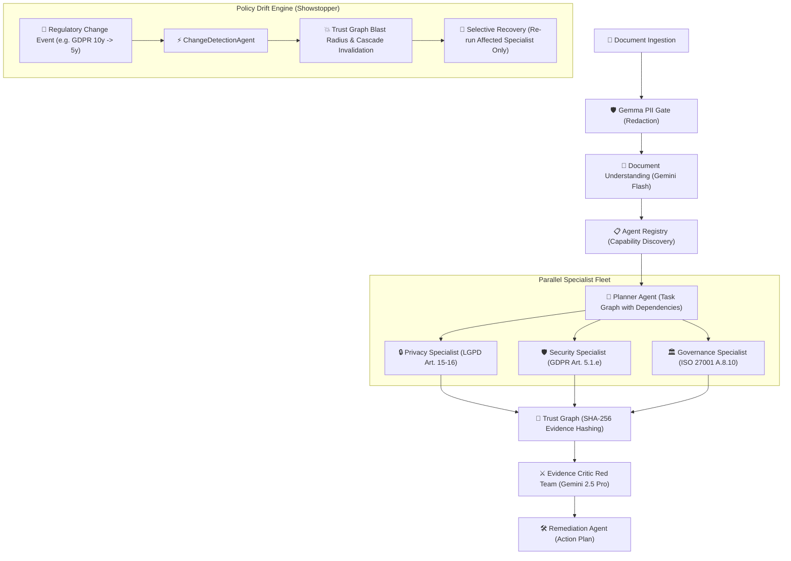

# AEGIS — Autonomous Enterprise Governance Intelligence System

[](tests/)
[](requirements.txt)
[](#)
[](#multi-model-ai-architecture)

> **"The investigation was complete. Then the rules changed. AEGIS reacted autonomously."**

AEGIS is an autonomous multi-agent governance platform designed for continuous regulatory compliance, adversarial evidence auditing, and real-time policy drift adaptation across complex multi-jurisdiction environments (**LGPD**, **GDPR**, **ISO 27001**).

---

## 🏆 Multi-Model AI Architecture (+0.4 Hackathon Bonus)

AEGIS implements a fortified multi-model strategy utilizing specialized Google models with a built-in deterministic fallback engine (`REPLAY_MODE`):

| Agent / Component | Model | Role & Purpose | Bonus Justification |
|---|---|---|:---:|
| **PII Gate Scanner** | **Gemma (Model Garden)** | Pre-flight privacy sanitization of sensitive documents (CPF, emails, tokens, IP traces) before any LLM ingestion. | (Specialized Open Model) |
| **Document Understanding & Planner** | **Gemini 2.5 Flash** | Sub-second extraction of jurisdictions, obligations, and dynamic specialist task routing. | Core Multi-Agent Fleet |
| **Domain Specialists (Privacy, Security, Governance)** | **Gemini 2.5 Flash** | High-throughput regulatory compliance auditing against legal frameworks with exact citation extraction. | Core Multi-Agent Fleet |
| **Evidence Critic (Red Team Auditor)** | **Gemini 2.5 Pro** | Adversarial auditor with deep reasoning to challenge findings, detect false positives, and verify citation provenance. | (Adversarial Pro Reasoning) |
| **Remediation Specialist** | **Gemini 2.5 Flash** | Actionable corrective planning, assigned owners, and deadline estimation. | Core Multi-Agent Fleet |
| **Change Detection Agent** | **Gemini 2.5 Flash** | Real-time monitoring of regulatory updates and autonomous Selective Recovery orchestration. | Showstopper Engine |

---

## ⚡ Architecture & Agent Fleet



---

## 🔒 Verified Evidence & Trust Graph

Every finding produced by AEGIS is anchored in **immutable cryptographic evidence**:

```text
[Evidence Schema Contract]
{
  "id": "ev-sec-101",
  "document_id": "doc-demo-01",
  "page_number": 4,
  "quote": "Logs de auditoria e telemetria sao retidos por 10 anos em storage frio.",
  "provenance": "Secao 4.1 - Telemetria e Logs",
  "confidence_score": 0.95,
  "content_hash": "f66259dfaa4ce578491cba04169542031c2518e807be58a74e50aeebca5a3f37",
  "dependencies": ["doc-demo-01"]
}
```

### Trust Graph Cascade & Selective Recovery
When a regulatory baseline shifts (e.g., EDPB reduces log retention limit from 10 to 5 years):
1. **Blast Radius Analysis**: AEGIS traverses the Trust Graph dependency tree to locate invalidated evidence nodes.
2. **Cascade Invalidation**: Dependent nodes are automatically marked `valid: false` with timestamp and reason.
3. **Investigation Reopened**: Investigation status transitions to `REOPENED`.
4. **Selective Recovery**: Instead of re-analyzing the entire document, AEGIS invokes **only** the affected specialist agent (`SecurityAgent`), maintaining 100% data integrity with minimal compute cost.

---

## 🚀 Quickstart & Demo Execution

### 1. Installation & Environment Setup
```bash
# Clone the repository
git clone https://github.com/josielqrozjr/aegis-autonomous-agentic.git
cd aegis

# Create virtual environment and install dependencies
python -m venv .venv
.\.venv\Scripts\activate  # On Linux/macOS: source .venv/bin/activate
pip install -r requirements.txt
```

### 2. Run the Live Interactive Demo Runner (≤ 4 minutes)
```bash
python demo_runner.py --auto --delay 0.5
```

### 3. Run the Automated Test Suite (78 Tests)
```bash
pytest tests/ -v
```

### 4. Inspect Public Model Conformance Endpoint
Start the API and inspect the live model conformance report:
```bash
uvicorn apps.api.app.main:app --reload --port 8000
# Access http://localhost:8000/api/v1/conformance
```

---

## 📁 Repository Structure

```text
aegis/
├── apps/
│   ├── api/          # FastAPI REST Gateway, Trust Graph endpoints, Conformance route
│   └── worker/       # Async Pipeline Handler (Investigation & Regulatory Change)
├── src/aegis/
│   ├── models/       # Multi-Model AI Layer (Gemini Flash, Gemini Pro, Gemma, Fallback)
│   ├── agents/       # Specialist Fleet, Evidence Critic, Remediation, Change Detection
│   ├── registry/     # Dynamic Capability Registry & Agent Discovery
│   └── schemas/      # Pydantic v Strict Contracts & Trust Graph Nodes
├── data/demo/        # Synthetic Multi-Jurisdiction Policy & Versioned Regulations
├── demo_runner.py    # Live CLI Video Pitch Orchestrator
└── tests/            # End-to-end and unit tests suite (78 tests)
```

---

## 👥 Team
- **Dev 1 (Cainã):** AI / Agent Architecture Lead
- **Dev  (Josiel):** Backend / Cloud Infrastructure Lead
- **Dev 3:** Fullstack UI / Frontend Lead
- **Dev 4:** Documentation / Devpost Lead
